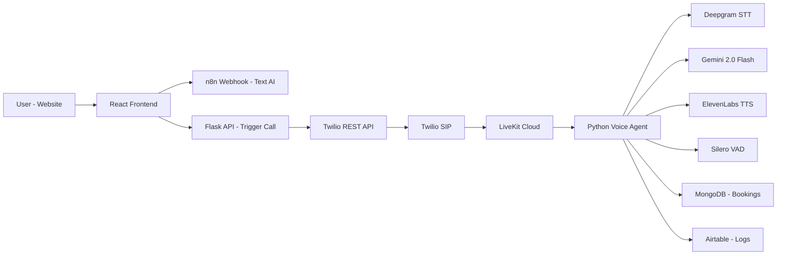

# 🎙️ StyleCut Salon — Dual-Modal AI Receptionist System

<p align="center">
  
  
  
  
  
  
  
  
</p>

---

## 🚀 Overview

**StyleCut Salon** is a full-stack AI Receptionist system that blends:

- 💬 Text-based AI chat (via n8n Webhook)
- 📞 Real-time streaming voice AI (via LiveKit + Twilio)
- ⚡ Sub-second conversational latency
- 🧠 Intelligent booking automation with database integration

It enables customers to chat on the website and instantly receive an outbound AI phone call to complete their appointment booking — creating a seamless dual-modal experience.

---

# ✨ Key Features

## 🎯 Dual-Modal AI Experience
- Website chat assistant
- Click-to-call appointment trigger
- Seamless transition from text → voice

## ⚡ Ultra-Low Latency Voice
- Streaming Speech-to-Text (Deepgram)
- Fast reasoning via Gemini 2.0 Flash
- Real-time streaming Text-to-Speech
- Barge-in interruption support (Silero VAD)

## 📞 Telephony Infrastructure
- Twilio SIP Trunking
- Outbound REST API calls
- LiveKit SIP routing
- Secure server-side call initiation

## 📊 Automated Booking & Logging
- Smart appointment booking in MongoDB
- Structured call transcript logging in Airtable
- Context-aware conversation memory

---

# 🏗️ Architecture Overview



---

# 🧩 Project Structure

```
stylecut-salon-ai/
│
├── voice-agent/           # Python LiveKit AI Worker
│   ├── agent.py
│   ├── requirements.txt
│   └── .env
│
├── stylecut-salon/        # React Frontend
│   ├── src/
│   ├── public/
│   └── package.json
│
├── flask-server/          # Voice Trigger API
│   ├── app.py
│   └── .env
│
└── README.md
```

---

# 🛠️ Tech Stack

## 🖥️ Frontend
- React 19
- Tailwind CSS 3.4
- n8n Webhooks

## 🎙️ Voice AI Backend
- LiveKit Agents v1.4.4
- Deepgram (Speech-to-Text)
- Google Gemini 2.0 Flash (LLM + Tool Calling)
- ElevenLabs (Text-to-Speech)
- Silero VAD (Voice Activity Detection)

## ☎️ Telephony
- Twilio SIP Trunking
- Twilio Outbound REST API

## 🗄️ Databases
- MongoDB (Bookings)
- Airtable (Call Logs)

---

# 🔄 System Flow

1️⃣ User chats on website  
2️⃣ AI collects booking details  
3️⃣ User provides phone number  
4️⃣ Frontend sends number securely to Flask API  
5️⃣ Flask triggers Twilio outbound call  
6️⃣ Twilio routes call to LiveKit SIP  
7️⃣ LiveKit connects to Python Voice Agent  
8️⃣ AI handles real-time conversation  
9️⃣ Booking saved to MongoDB  
🔟 Transcript logged to Airtable  

---

# 🔐 Security Design

- 🔒 API keys stored in `.env`
- 🔒 Phone numbers handled server-side only
- 🔒 Twilio credentials never exposed to frontend
- 🔒 LiveKit authentication via API key/secret
- 🔒 HTTPS communication between services

---

# ⚙️ Installation & Setup

## 1️⃣ Clone Repository

```bash
git clone https://github.com/yourusername/stylecut-salon-ai.git
cd stylecut-salon-ai
```

---

## 2️⃣ Voice Agent Setup

```bash
cd voice-agent
pip install -r requirements.txt
python agent.py
```

---

## 3️⃣ Frontend Setup

```bash
cd stylecut-salon
npm install
npm run dev
```

---

## 4️⃣ Flask Trigger API

```bash
cd flask-server
pip install flask twilio python-dotenv
python app.py
```

---

# 📈 Performance Optimizations

- Telephone-optimized Deepgram model
- Gemini 2.0 Flash for minimal inference delay
- Streaming audio pipeline (no blocking calls)
- Tuned Silero VAD thresholds
- SIP trunking for direct routing
- Parallel tool-calling architecture

---

# 🧠 Engineering Challenges Solved

- Secure phone number handoff from frontend to backend
- Low-latency AI voice pipeline
- Natural interruption handling (barge-in)
- Real-time booking confirmation
- Synchronizing multi-service APIs

---

# 🚀 Future Improvements

- 🌍 Multi-language support
- 🐳 Dockerized deployment
- ☁️ Cloud-native serverless trigger API
- 📊 Admin analytics dashboard
- 🔐 Role-based authentication system

